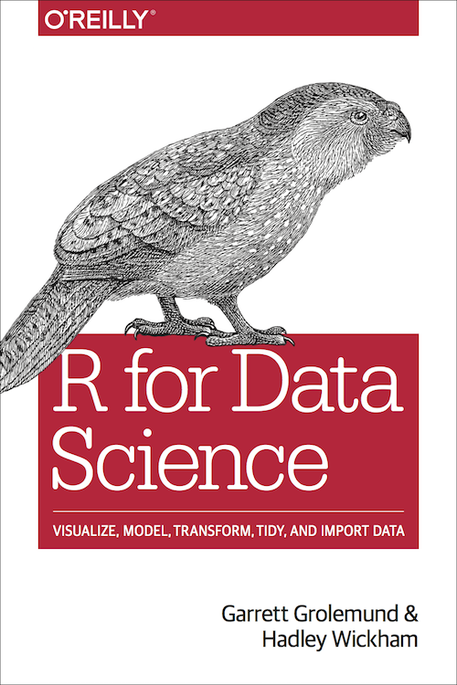
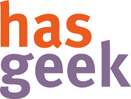

# Intro to Data Science in R
### @unnati_xyz | @hasgeek

---

# Welcome

---

# Facilitators

---

# Amit
## @amitkaps

---

# Nischal
## @nischalhp

---

# Raghotham
## @raghothams

---

# Bargava
## @bargava

---

# Shrayas
## @shrayasr

---

# See the world through a data lens

---

# "Data is just a clue to the end truth"
-- Josh Smith

---

# Data Driven Decisions

---

# "Science is knowledge which we understand so well that we can teach it to a computer. Everything else is art"
-- Donald Knuth

---

# Data Science is an Art

---

# Hypothesis Driven Approach

---

# Frame
## "An approximate answer to the right problem is worth a good deal"

---

# Acquire
## "80% perspiration, 10% great idea, 10% great output"

---

# Refine
## "All data is messy."

---

# Explore
## "I don't know, what I don't know."

---

# Model
## "All models are wrong, but some are useful"

---

# Insight
## "The goal is to turn data into insight"

---

---

## "Doing data analyis requires quite a bit of thinking and we believe that when you’ve completed a good data analysis, you’ve spent more time thinking than doing."
-- Roger Peng

---

# R Data Stack

---

# Case Studies

---
# Peeling the Onion

---

# Kitna Deti Hain (Cars)

---

# Bank Marketing 

---

# Learning Approach

---

# Do the Exercises

---

# Pair up & Learn

---

# Call for Help

---

# Schedule

---

## Session 0 (0830 - 0930)
- Installation

## Session 1 (0930 - 1115)
- Overview of Data Science
- Data Science Process
- How to use Jupyter Notebook
- Intro to Data Structures in R

---

## Session 2 (1135 - 1300)
- Case 1: Peeling the Onion
- Exploring Onion Price and Quantity

## Session 3 (1400 - 1530)
- Fun visualization exercise
- Modelling the Onion data
- Communicating the Onion Insights

---

## Session 4 (1550 - 1730)
- Acquiring the Onion data (Web Scraping)
- Refining the Onion Data

## Optional Advanced Session (1730 - 1830)
- Working with SQL to Acquire and Refine Data
- Real life Scraping
- Office Hours

---

# Welcome Back

---

## Session 5 (0930 - 1115)
- Reflections
- Intro to Machine Learning
- Case 2: Kitna Deti Hain
- Linear Regression

## Session 6 (1135 - 1300)
- Case 2: Continued

---

## Session 7 (1400 - 1530)
- Fun Demo : Music Visualization
- Case 5: Bank Marketing
- Decision Trees for Classification
- Logistic Regression for Classification

## Session 8 (1550 - 1730)
- Bank Marketing (contd.)
- Recap and Way Forward
- Feedback

---

## Food and Hydration
 
### 0830 - 0930: Breakfast
### 1115 - 1135: Tea Break
### 1300 - 1400: Lunch
### 1530 - 1550: Tea Break

---

# Enjoy the workshop

---

# Recap

---

---

# Frame
- **Toy Problems**
- **Simple Problems**
- Complex Problems
- Business Problems
- Research Problems

---

# Acquire
- **Scraping** (structured, unstructured)
- **Files** (csv, xls, json, xml, pdf, ...)
- **Database** (sqlite, ...)
- APIs
- Streaming

---

# Refine
- Data Cleaning (inconsistent, missing, ...)
- Data Refining (derive, parse, merge, filter, convert, ...)
- **Data Transformations** (group by, pivot, aggregate, sample, summarise, ...)

---

# Explore
- **Simple Vis**
- Multi Dimensional Vis
- Geographic Vis
- Large Data Vis (Bin - Summarise - Smooth)
- Interactive Vis

---

# Model - Supervised Learning
- *Continuous*: Regression - **Linear**, Polynomial, Tree Based Methods - CART, Random Forest, Gradient Boosting Machines
- *Classification* - **Logistic Regression**, Tree, KNN, SVM, Naive-Bayes. Bayesian Network

---

# Model - UnSupervised Learning
- *Continuous*: Clustering & Dimensionality Reduction like PCA, SVD, MDS, K-means
- *Categorical*: Association Analysis

---

# Model - Advanced / Specialized
- Network / Graph Analytics
- Optimization
- Reinforcement Learning
- Online Learning
- Deep Learning
- Applications: Time Series, Text, Image, Speech

---

# Insight
- Narrative Visualisation
- Dashboard Visualisation
- Decision Making Tools
- Automated Decision Tools

---

# R Stack
- **Acquire**: `rvest, XML, jsonlite, httr, RSQLite, RPostgreSQL, readxl, haven, readr, data.table` 
- **Refine**: `dplyr, tidyr, lubridate, stringr`
- **Explore**: `graphics, ggplot2, ggvis, ggmap, map, vcd, rgl, htmlwidgets, leaflet, choroplethr, plotly`
- **Model**: `stats, caret, ranger, glmnet, xgboost, party, mxnet, forecast`
- **Insight**: `OpenCPU, Rserve, shiny, RMarkdown, knitr`

---

# Skills

---

---

# Resources
## Books and Videos

---

# R for Data Science
A good introduction to the process of data science and its application in R. Written by creators of `dplyr` and `ggplot2` library.

[http://r4ds.had.co.nz/](http://r4ds.had.co.nz/)

---

# Introduction to Statistical Learning
A very good introduction book with both the math around all learning models as well as code in R to implement it.

[http://www-bcf.usc.edu/~gareth/ISL/index.html](http://www-bcf.usc.edu/~gareth/ISL/index.html)

---

# Online Courses
- **[Data Analysis with R - Udacity](https://www.udacity.com/course/data-analysis-with-r--ud651)**: An introductory course on doing Exploratory Data Analysis in R

- **[Data Science Specialisation - Coursera](https://www.coursera.org/specializations/jhu-data-science)** by John Hopkins University: A comprehensive set of courses on the process of data science designed in R. You can get all the slides and code from - [https://github.com/DataScienceSpecialization/courses](https://github.com/DataScienceSpecialization/courses)

---

# Upcoming Workshops
- Advanced Data Science (Machine Learning, Statistics) - *Coming up in June 2016*
- Data Science at Scale (Spark)
- Visualisation (Multi-Dimensional, Geographic, Large Data)
- Deep Learning (Text, Speech, Image, Video)

---

# Speak to Us!
 
## Custom Workshops
## Data Science Consulting

---

# Thank you
## [unnati.xyz/workshop-feedback](http://unnati.xyz/workshop-feedback)

---

# Follow and Contact us
- Twitter: [http://twitter.com/unnati_xyz](http://twitter.com/unnati_xyz)
- Facebook: [https://www.facebook.com/unnati.xyz](https://www.facebook.com/unnati.xyz)
- Github: [https://github.com/unnati-xyz](https://github.com/unnati-xyz)
- Email: [enquiry@unnati.xyz](mailto:enquiry@unnati.xyz?subject=Data%20Science%20Enquiry)

---

